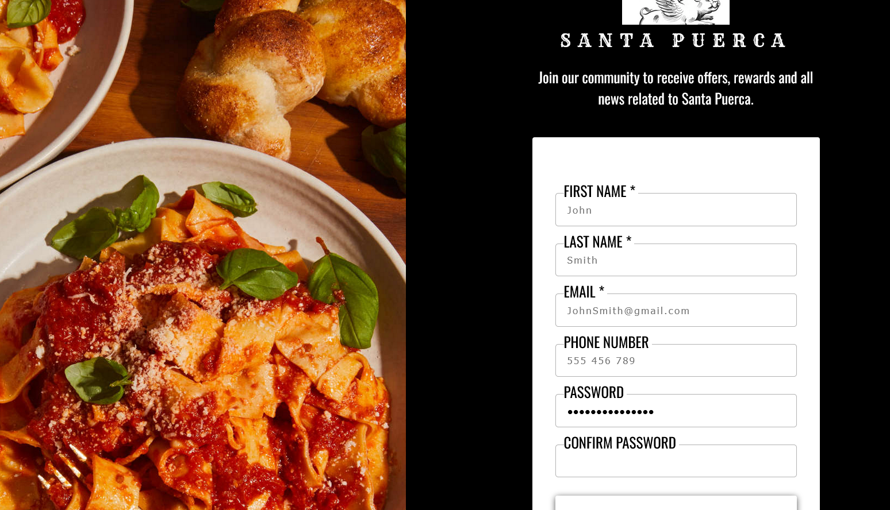

# Sign Up Form
Part of the Odin Project's curriculum

## Built with
- HTML
* CSS
+ JS

## Tools
- Visual Studio Code
- Git and GitHub

## Third party code
- Google Fonts
- Google Images

## Outcome
 - Improved usage of CSS Flex properties, specially object positioning while using images.
 - Additional password match validation with the use of JavaScript.

## Live preview [here](https://bonemuffin.github.io/PROJECT.Sign-Up-formOdin/signUpIndex.html)

